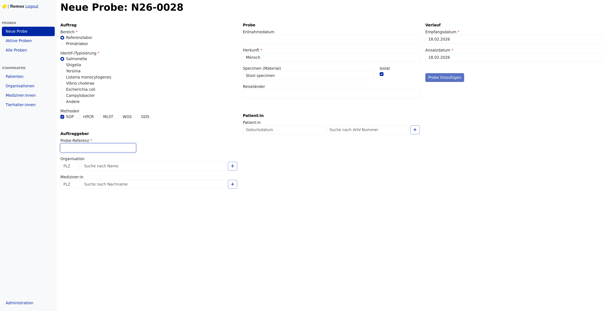
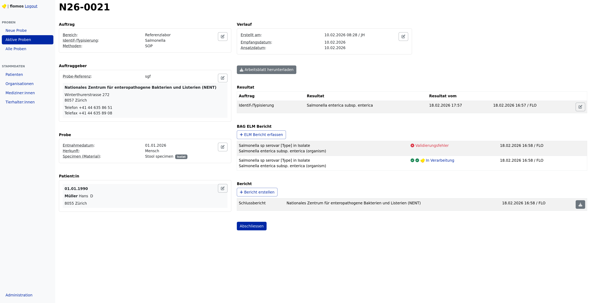

# ENTE

This tool helps a laboratory to track their diagnostic material and results.

Principal features:
- Manage orders from organizations and practitioners over a variety of pathogens and methods
- Store meta-data about the probes, e.g. patient or animal source, date of collection, etc.
- Generate a worksheet with the most important information for each probe
- Attach diagnostic results to the probe, structured using code styles such as SNOMED and LOINC
- Submit the results electronically over CH ELM (FHIR)
- Generate PDF reports of the results
- Search probes and master data, and probes by master data (e.g., all probes of a specific patient)
- Invoicing and statistics

## Add a new probe

## View a probe, attach results and generate reports (CH ELM, PDF)

